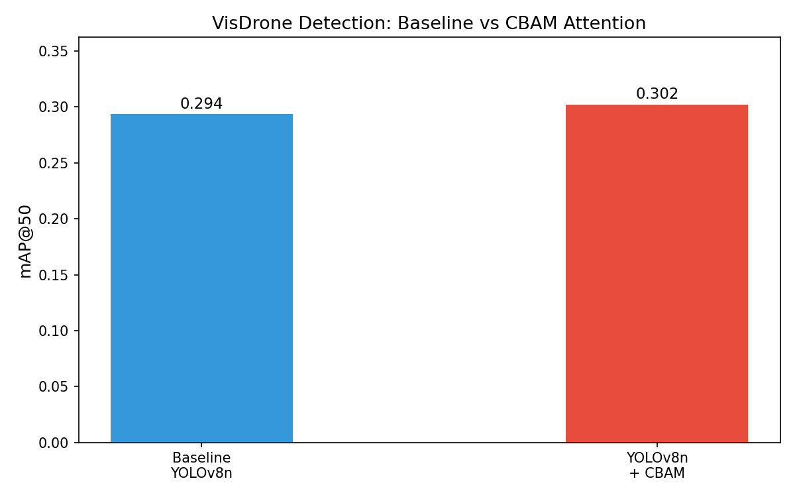
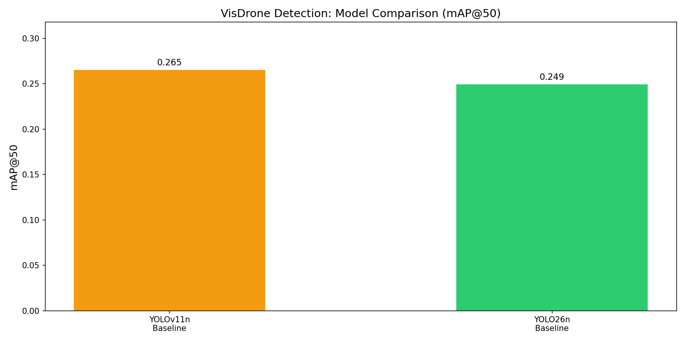
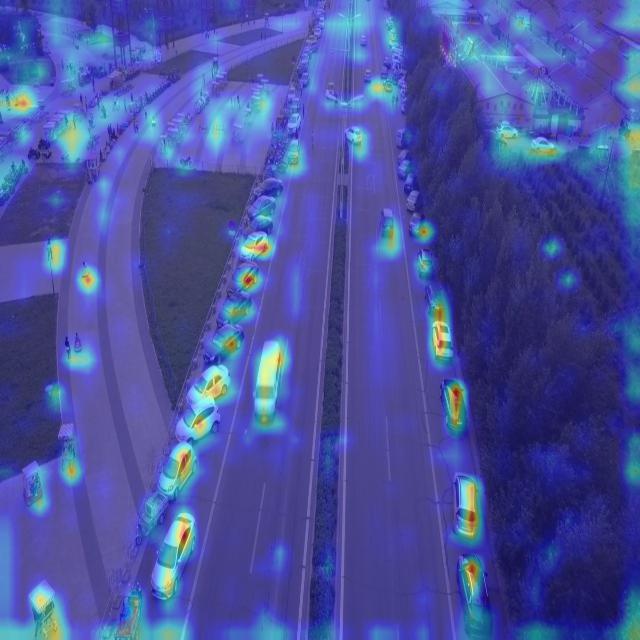
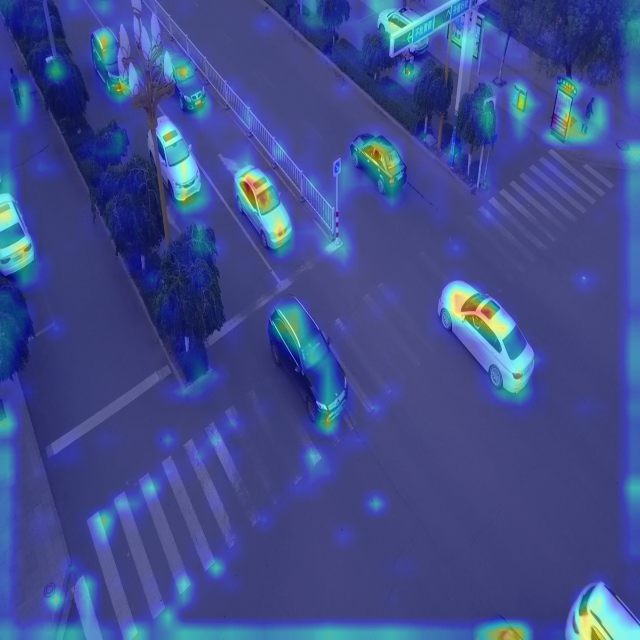
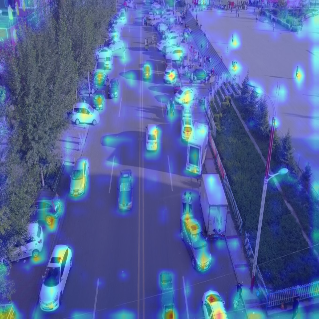
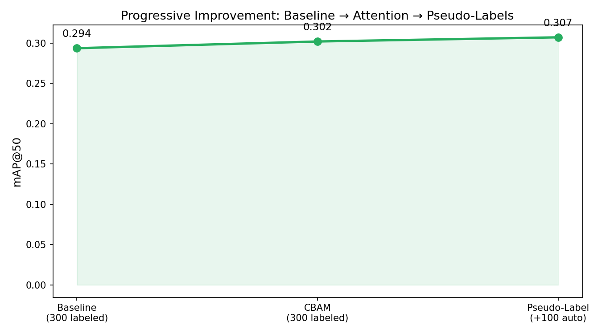

# UAV Small Object Detector

> YOLOv8 + CBAM Attention + Attention Heatmaps + Pseudo-Labeling on VisDrone — built for UAV perception research

<p align="left">
  <a href="https://www.python.org/">
    
  </a>
  <a href="https://pytorch.org/">
    
  </a>
  <a href="https://colab.research.google.com/">
    
  </a>
  <a href="https://docs.ultralytics.com/datasets/detect/visdrone/">
    
  </a>
</p>


## Results

| Model | mAP@50 | mAP@50-95 | Precision | Recall |
|---|---|---|---|---|
| YOLOv8n Baseline | 0.2937 | 0.1662 | 0.3915 | 0.3025 |
| YOLOv8n + CBAM Attention | 0.3020 | 0.1727 | 0.4146 | 0.3024 |
| + Pseudo-Label Expansion | 0.3072 | 0.1755 | 0.4185 | 0.3119 |
| YOLOv11n Baseline | 0.2652 | 0.1476 | 0.3882 | 0.3012 |
| YOLO26n Baseline | 0.2494 | 0.1374 | 0.3677 | 0.2910 |

Key gains:

- CBAM improved mAP@50 by `+0.0083` over the baseline.
- Pseudo-labeling improved mAP@50 by `+0.0135` over the baseline.
- The pseudo-label stage improved mAP@50 by `+0.0052` over the CBAM model.
- Pseudo-label acceptance rate was `100/100` images.

> Evaluated on the VisDrone2019-DET validation split (548 images).
> Trained on Google Colab with a T4 GPU. End-to-end runtime is roughly 1.5 to 2 hours including dataset download.

### Baseline vs CBAM Performance



### Cross-Architecture Comparison



A comparative analysis was conducted between YOLOv8n, YOLOv11n, and YOLO26n baselines on the VisDrone dataset. 

#### Understanding the Benchmarks
While YOLO11 and YOLO26 are theoretically more efficient and modern, the results in this project (trained for 20 epochs at 640px) show the YOLOv8n baseline maintaining a lead. This is driven by several technical factors:

- **Raw Computational Capacity (GFLOPs):** In the "Nano" category, YOLOv8n is actually a "heavier" model (~3.0M params, 8.2 GFLOPs) compared to YOLO11n (2.6M params, 6.5 GFLOPs) and YOLO26n (2.5M params, 5.8 GFLOPs). This extra 26-40% in computational "brute force" allows YOLOv8n to model high-density tiny objects more effectively in short training runs.
- **Resolution Sensitivity:** VisDrone objects are often just 10-20 pixels wide. When downsampling to `imgsz=640`, the simpler convolutional blocks (`C2f`) in YOLOv8n prove to be more stable than the sophisticated attention-based modules (`PSA`) in newer models, which typically require higher resolutions or longer training to refine their focus.
- **Convergence Speed:** Newer architectures are optimized for deep, long-term convergence (100+ epochs). In a 20-epoch "sprint," the more mature and straightforward YOLOv8n architecture reaches a performance plateau faster.

---

## Detection Samples

The VisDrone dataset features extremely tiny, clustered objects from an aerial perspective. Below are sample model predictions showing bounding boxes on high-density scenes:

| Output 1 | Output 2 | Output 3 |
|---|---|---|
| 
 | 
 | 
 |

---

## Attention Visualizations

The visualization stage highlights where the CBAM-enhanced detector focuses in aerial scenes. Warm regions align with vehicles and pedestrians in dense traffic scenes, which provides qualitative evidence that the model is emphasizing relevant small-object regions.

| Sample 1 | Sample 2 | Sample 3 |
|---|---|---|
|  |  |  |

Full grid:


---

## Progressive Improvement



The project follows a simple three-stage progression:

1. Train a YOLOv8n baseline on VisDrone.
2. Inject CBAM attention into the backbone and fine-tune.
3. Expand the training set with pseudo-labels and retrain.

This produces a steady improvement from `0.294 -> 0.302 -> 0.307` on mAP@50.

---

## Architecture

### CBAM Attention Module

CBAM (Convolutional Block Attention Module) applies two sequential attention operations on YOLO feature maps:

- Channel attention answers "what to focus on" by reweighting feature channels.
- Spatial attention answers "where to focus" by emphasizing relevant spatial regions.

This is useful for UAV imagery because small objects occupy very few pixels and can easily be overwhelmed by background clutter.

```
Input Feature Map  [B x C x H x W]
         |
         v
+---------------------------+
|   Channel Attention        |  <- "What to focus on"
|  AvgPool + MaxPool         |
|  -> Shared MLP -> Sigmoid  |
|  -> Scale channels         |
+---------------------------+
         |
         v
+---------------------------+
|   Spatial Attention        |  <- "Where to focus"
|  Channel avg + max         |
|  -> 7x7 Conv -> Sigmoid    |
|  -> Scale spatial map      |
+---------------------------+
         |
         v
Attended Feature Map
```

### Integration Approach

CBAM is attached to the YOLOv8 backbone with a forward hook, which keeps the integration lightweight and avoids editing Ultralytics internals directly. The attention visualization stage uses hooked backbone activations to generate stable heatmap overlays in Colab.

---

## Pseudo-Labeling Pipeline

Manual annotation is expensive for drone footage, so the final stage expands the dataset with model-generated labels from unlabeled validation images.

```
300 Labeled VisDrone Images
         |
         v
    Train YOLOv8n + CBAM
         |
         v
100 Unlabeled Aerial Images
         |
    Run inference (conf > 0.5)
         |
Auto-generate YOLO labels
         |
         v
400 Total Training Images
(300 labeled + 100 pseudo-labeled)
         |
         v
    Retrain -> Higher mAP
```

In this run, the model accepted all `100/100` pseudo-labeled images.

---

## Repository Structure

```
uav-small-object-detector/
+-- README.md
+-- requirements.txt
+-- notebooks/
|   +-- 01_baseline_yolov8.ipynb
|   +-- 02_cbam_attention.ipynb
|   +-- 03_gradcam_viz.ipynb
|   +-- 04_pseudo_labeling.ipynb
|   +-- 05_yolov11_comparison.ipynb
|   +-- 06_yolo26_comparison.ipynb
+-- src/
|   +-- cbam.py
|   +-- gradcam_utils.py
|   +-- heatmap_utils.py
|   +-- pseudo_label.py
+-- results/
|   +-- all_progressions.png
|   +-- cbam_comparison.png
|   +-- full_progression.png
|   +-- gradcam_grid.png
|   +-- improvement_over_baseline.png
|   +-- metrics.json
|   +-- model_comparison_bar.png
|   +-- detection_samples/
|   +-- gradcam_samples/
|   +-- pseudo_labels/
+-- runs/
|   +-- detect/
```

---

## Run in Google Colab

| Notebook | Description | Open |
|---|---|---|
| 01 - Baseline | YOLOv8n training on VisDrone |  |
| 02 - CBAM | Attention mechanism integration |  |
| 03 - Visualizations | Attention heatmap visualization |  |
| 04 - Pseudo-Labels | Semi-supervised pipeline |  |
| 05 - YOLOv11 | YOLOv11n baseline comparison |  |
| 06 - YOLO26 | YOLO26n baseline comparison |  |
---


## Tech Stack

| Component | Library/Tool | Purpose |
|---|---|---|
| Base detector | YOLOv8n (Ultralytics) | Lightweight object detection backbone |
| Attention | CBAM (custom PyTorch) | Channel + spatial attention for small objects |
| Visualization | PyTorch hooks + OpenCV | Attention heatmap generation |
| Dataset | VisDrone2019-DET | Public aerial imagery benchmark (10 classes) |
| Training | Google Colab (T4 GPU) | Free GPU training workflow |
| Framework | PyTorch + Ultralytics | Detection and training pipeline |
| Plotting | matplotlib, OpenCV | Charts and qualitative outputs |

---

## Dataset

**VisDrone2019-DET** — a large-scale aerial imagery dataset collected by the
AISKYEYE team from the Lab of Machine Learning and Data Mining, Tianjin University.

- **Source:** [VisDrone Dataset GitHub](https://github.com/VisDrone/VisDrone-Dataset)
- **Ultralytics docs:** [VisDrone detection dataset](https://docs.ultralytics.com/datasets/detect/visdrone/)
- **Classes (10):** pedestrian, people, bicycle, car, van, truck, tricycle, awning-tricycle, bus, motor
- **Validation split used here:** `548` images
- **Training split used here:** `6471` images
- **Format:** converted to YOLO text labels in the notebooks

---

## How to Run (Google Colab)

This project is optimized for **Google Colab** using a **T4 GPU** runtime. Follow these steps to replicate the results:

### 1. Prepare Google Drive
1. Download this repository as a ZIP or clone it.
2. Upload the `uav-small-object-detector/` folder to your Google Drive (e.g., in a folder named `DeepLearning/`).

### 2. Configure Colab Runtime
1. Open any notebook from the `notebooks/` folder in Google Colab.
2. Go to **Runtime** > **Change runtime type**.
3. Select **T4 GPU** as the Hardware accelerator.

### 3. Execution Steps
1. **Mount Drive**: Every notebook starts with a cell to mount your Google Drive.
   ```python
   from google.colab import drive
   drive.mount('/content/drive')
   ```
2. **Set Path**: Update the path variable in the first code cell to point to your uploaded folder.
   ```python
   import os
   current_path = '/content/drive/MyDrive/DeepLearning/uav-small-object-detector'
   os.chdir(current_path)
   ```
3. **Run Sequentially**: Execute the notebooks in order (`01` through `04`). The data, weights, and results will automatically save to your Drive folder.

Then run the notebooks sequentially in Google Colab:

1. `notebooks/01_baseline_yolov8.ipynb`
2. `notebooks/02_cbam_attention.ipynb`
3. `notebooks/03_gradcam_viz.ipynb`
4. `notebooks/04_pseudo_labeling.ipynb`
5. `notebooks/05_yolov11_comparison.ipynb` (Optional)
6. `notebooks/06_yolo26_comparison.ipynb` (Optional)

---

## License

This project is licensed under the MIT License - see the [LICENSE](LICENSE) file for details.
