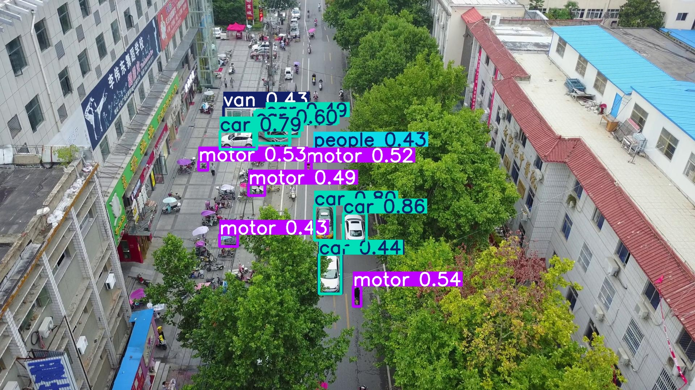
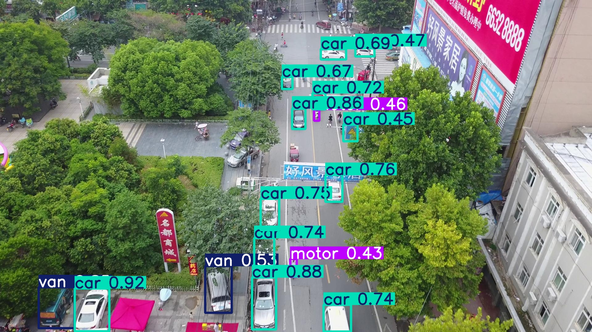
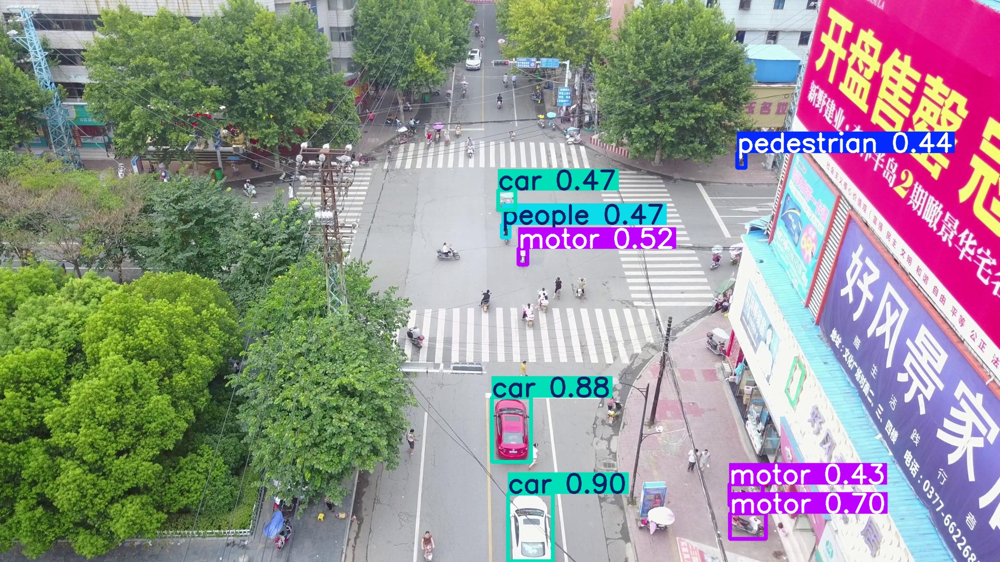

# UAV Small Object Detector

> YOLOv8 + CBAM Attention + Attention Heatmaps + Pseudo-Labeling on VisDrone — built for UAV perception research

<p align="left">
  <a href="https://www.python.org/">
    
  </a>
  <a href="https://pytorch.org/">
    
  </a>
  <a href="https://colab.research.google.com/">
    
  </a>
  <a href="https://docs.ultralytics.com/datasets/detect/visdrone/">
    
  </a>
</p>


## Results

| Model | mAP@50 | mAP@50-95 | Precision | Recall |
|---|---|---|---|---|
| YOLOv8n Baseline | 0.2937 | 0.1662 | 0.3915 | 0.3025 |
| YOLOv8n + CBAM Attention | 0.3020 | 0.1727 | 0.4146 | 0.3024 |
| + Pseudo-Label Expansion | 0.3072 | 0.1755 | 0.4185 | 0.3119 |

Key gains:

- CBAM improved mAP@50 by `+0.0083` over the baseline.
- Pseudo-labeling improved mAP@50 by `+0.0135` over the baseline.
- The pseudo-label stage improved mAP@50 by `+0.0052` over the CBAM model.
- Pseudo-label acceptance rate was `100/100` images.

> Evaluated on the VisDrone2019-DET validation split (548 images).
> Trained on Google Colab with a T4 GPU. End-to-end runtime is roughly 1.5 to 2 hours including dataset download.

### Baseline vs CBAM Performance


---

## Detection Samples

The VisDrone dataset features extremely tiny, clustered objects from an aerial perspective. Below are sample model predictions showing bounding boxes on high-density scenes:

| Output 1 | Output 2 | Output 3 |
|---|---|---|
|  |  |  |

---

## Attention Visualizations

The visualization stage highlights where the CBAM-enhanced detector focuses in aerial scenes. Warm regions align with vehicles and pedestrians in dense traffic scenes, which provides qualitative evidence that the model is emphasizing relevant small-object regions.

| Sample 1 | Sample 2 | Sample 3 |
|---|---|---|
|  |  |  |

Full grid:


---

## Progressive Improvement


The project follows a simple three-stage progression:

1. Train a YOLOv8n baseline on VisDrone.
2. Inject CBAM attention into the backbone and fine-tune.
3. Expand the training set with pseudo-labels and retrain.

This produces a steady improvement from `0.294 -> 0.302 -> 0.307` on mAP@50.

---

## Architecture

### CBAM Attention Module

CBAM (Convolutional Block Attention Module) applies two sequential attention operations on YOLO feature maps:

- Channel attention answers "what to focus on" by reweighting feature channels.
- Spatial attention answers "where to focus" by emphasizing relevant spatial regions.

This is useful for UAV imagery because small objects occupy very few pixels and can easily be overwhelmed by background clutter.

```
Input Feature Map  [B x C x H x W]
         |
         v
+---------------------------+
|   Channel Attention        |  <- "What to focus on"
|  AvgPool + MaxPool         |
|  -> Shared MLP -> Sigmoid  |
|  -> Scale channels         |
+---------------------------+
         |
         v
+---------------------------+
|   Spatial Attention        |  <- "Where to focus"
|  Channel avg + max         |
|  -> 7x7 Conv -> Sigmoid    |
|  -> Scale spatial map      |
+---------------------------+
         |
         v
Attended Feature Map
```

### Integration Approach

CBAM is attached to the YOLOv8 backbone with a forward hook, which keeps the integration lightweight and avoids editing Ultralytics internals directly. The attention visualization stage uses hooked backbone activations to generate stable heatmap overlays in Colab.

---

## Pseudo-Labeling Pipeline

Manual annotation is expensive for drone footage, so the final stage expands the dataset with model-generated labels from unlabeled validation images.

```
300 Labeled VisDrone Images
         |
         v
    Train YOLOv8n + CBAM
         |
         v
100 Unlabeled Aerial Images
         |
    Run inference (conf > 0.5)
         |
Auto-generate YOLO labels
         |
         v
400 Total Training Images
(300 labeled + 100 pseudo-labeled)
         |
         v
    Retrain -> Higher mAP
```

In this run, the model accepted all `100/100` pseudo-labeled images.

---

## Repository Structure

```
uav-small-object-detector/
+-- README.md
+-- requirements.txt
+-- notebooks/
|   +-- 01_baseline_yolov8.ipynb
|   +-- 02_cbam_attention.ipynb
|   +-- 03_gradcam_viz.ipynb
|   +-- 04_pseudo_labeling.ipynb
+-- src/
|   +-- cbam.py
|   +-- gradcam_utils.py
|   +-- heatmap_utils.py
|   +-- pseudo_label.py
+-- results/
|   +-- cbam_comparison.png
|   +-- full_progression.png
|   +-- gradcam_grid.png
|   +-- metrics.json
|   +-- detection_samples/
|   +-- gradcam_samples/
|   +-- pseudo_labels/
+-- runs/
|   +-- detect/
```

---

## Run in Google Colab

| Notebook | Description | Open |
|---|---|---|
| 01 - Baseline | YOLOv8n training on VisDrone |  |
| 02 - CBAM | Attention mechanism integration |  |
| 03 - Visualizations | Attention heatmap visualization |  |
| 04 - Pseudo-Labels | Semi-supervised pipeline |  |
---


## Tech Stack

| Component | Library/Tool | Purpose |
|---|---|---|
| Base detector | YOLOv8n (Ultralytics) | Lightweight object detection backbone |
| Attention | CBAM (custom PyTorch) | Channel + spatial attention for small objects |
| Visualization | PyTorch hooks + OpenCV | Attention heatmap generation |
| Dataset | VisDrone2019-DET | Public aerial imagery benchmark (10 classes) |
| Training | Google Colab (T4 GPU) | Free GPU training workflow |
| Framework | PyTorch + Ultralytics | Detection and training pipeline |
| Plotting | matplotlib, OpenCV | Charts and qualitative outputs |

---

## Dataset

**VisDrone2019-DET** — a large-scale aerial imagery dataset collected by the
AISKYEYE team from the Lab of Machine Learning and Data Mining, Tianjin University.

- **Source:** [VisDrone Dataset GitHub](https://github.com/VisDrone/VisDrone-Dataset)
- **Ultralytics docs:** [VisDrone detection dataset](https://docs.ultralytics.com/datasets/detect/visdrone/)
- **Classes (10):** pedestrian, people, bicycle, car, van, truck, tricycle, awning-tricycle, bus, motor
- **Validation split used here:** `548` images
- **Training split used here:** `6471` images
- **Format:** converted to YOLO text labels in the notebooks

---

## Quick Start

```bash
git clone https://github.com/YOUR_USERNAME/uav-small-object-detector.git
cd uav-small-object-detector
pip install -r requirements.txt
```

---

Then run the notebooks sequentially in Google Colab:

1. `notebooks/01_baseline_yolov8.ipynb`
2. `notebooks/02_cbam_attention.ipynb`
3. `notebooks/03_gradcam_viz.ipynb`
4. `notebooks/04_pseudo_labeling.ipynb`

---

## License

This project is licensed under the MIT License - see the [LICENSE](LICENSE) file for details.
